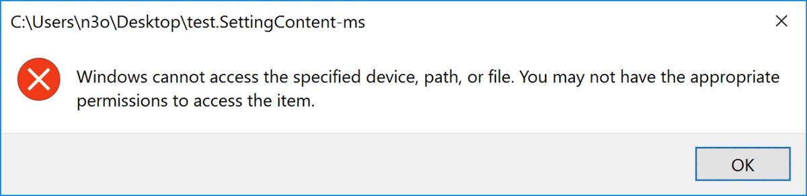

# SettingContent-ms Wrapper

SettingContent-ms files have been recently used by various loaders to infect endpoints:

* [Windows .SettingContent-ms Files Weaponized to Bypass Security, Deliver Malware](https://blog.barkly.com/windows-settingcontent-ms-files-weaponized-deep-link-technique)
* [TA505 Abusing SettingContent-ms within PDF files to Distribute FlawedAmmyy RAT](https://www.proofpoint.com/us/threat-insight/post/ta505-abusing-settingcontent-ms-within-pdf-files-distribute-flawedammyy-rat)

**SettingContent-ms only works on Windows 10 and only if the Windows Search is enabled.**

SettingContent-ms Wrapper removes those limitations. It enables to execute SettingContent-ms files on any Windows version as well as Windows 10 with Windows Search disabled. 

How to use it? First install SettingContent-ms Wrapper (you need Administrator privileges):

        scmwrap.exe -install

To launch a SettingContent-Ms file simply double click. SettingContent-Ms files are also launched correctly by third party application e.g. Adobe Reader via /OpenAction or Word via VBA Macro:

Internally SettingContent-ms Wrapper uses FTYPE / ASSOC shell commands to overwrite the default application for .settingcontent-ms. On launch it parses the file for the DeepLink commandline.
